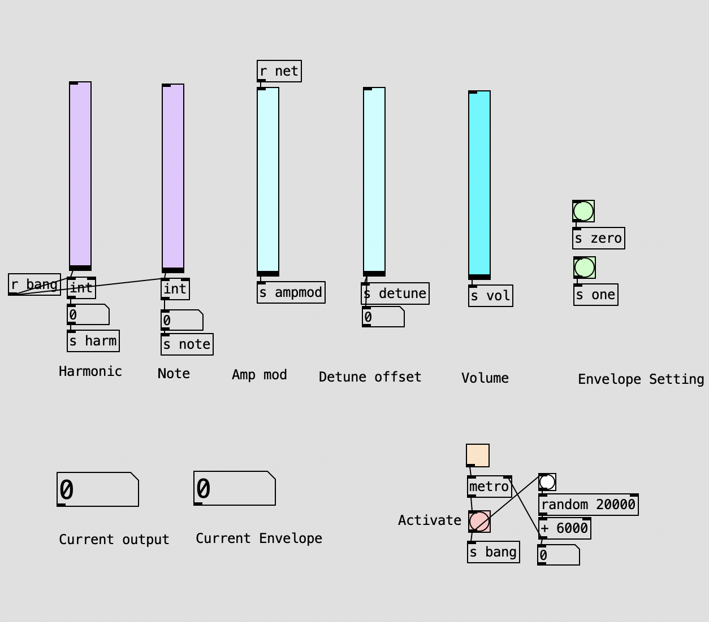
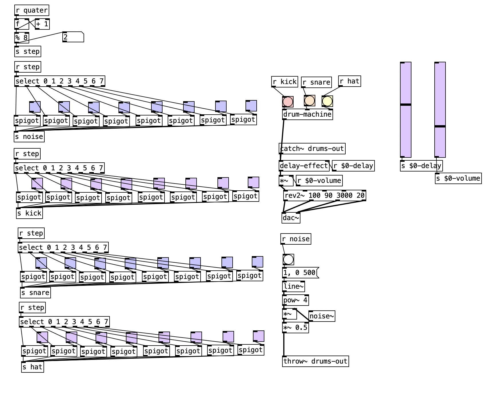

- **Title**: A Symphony of the Uncharted
- **Composer**: Samuel Dietz

# Description
My piece used generative/user influenced code to create the atmosphere of an unknown world and the vast emptiness of space. My piece is inspired by the simplicity and impact of ambient music especially its ability to heavily influence atmosphere. My pieces also takes influence from ambient generative music. However, uses independent performers to create a similar sound rather thann random or algorithmic computer generated values. 

# Files and Resources
**Pure Data:**
- delay-effect.pd: Patch which implements a delay effect to incoming signals
- drum-controller.pd: A sequencer to control the drum machine and introduce the delay effect.
- drum-machine.pd: Creates the drum sounds to be sequenced by the drum-controller
- effect_controller.pd: The effect_controller connects to the controller-tcp.py and sets the level of amplitude modulation to be broadcasted to all performers.
- fm-synth-detune.pd: The fm synth used within the performance. Also introduces a detuned frequency over the top of the main frequency.
- synth-controller.pd: The main controller used by all performers. This file uses fm-synth-detuned.pd to generate the sound as well as introduces all the effects ontop of the sound.

**Python:**
- controller-tcp.py: The server that connects the amplitude modulation of all the performers.
- recv-tcp.py: The client that receives the broadcasted messages and sends them to the synth-controller.pd patch.

# Server Code
The python server-client implementation I created allows data to be easily broadcasted between all pd users. Standard pd can implement server-client connections through 'netlisten' and 'netconnect'. However, the implementation does not allow a server to send messages, only listen, hence a different server or 'netlisten' would be required to implement two way communication and multiple net connections would need to be set for each user. My implementation allowed the server to listen to incoming requests and broadcast the inputs to any number of currently connected clients, greatly simplifying infrastructure required. This technique was implemented with both server and client files creating a dedicated connection to pure data to send or recieve data, while also implementing another connection to send and recieve messages between users as shown in *Code Snippet 1*.

```
def to_pd(stop: Event):
    while not stop.is_set():
        try:
            sock = socket.socket(socket.AF_INET, socket.SOCK_DGRAM)

            while not stop.is_set():
                msg = proxy_queue.get()
                
                sock.sendto(msg.to_bytes(2, byteorder='big'), ("localhost", localport))
        except Exception as e:
            print(e)
            sock.close()


def connect(stop: Event):

    with socket.socket(socket.AF_INET, socket.SOCK_STREAM) as sock:
        print("input ip:")
        ip = input()

        try:
            print(port)
            print(len(ip))
            print(ip)
            sock.connect((ip, port))
            print("connection successful...")
            while not stop.is_set():
                data = sock.recv(16)
                data = data.decode("utf-8")
                data = data.replace('\n', '').replace('\t','').replace('\r','').replace(';','')
                try:
                    data = int(float(data))
                    print(f"recv {data}")
                    proxy_queue.put(data)
                except Exception as e:
                    print(e)
            
            sock.close()
        except Exception as e:
            print(e)
```
*Code Snippet 1: code for recieving messages from the server and relaying messages to pd from recv-tcp.pd*

# Usage
Each member has control over an instance of synth-controller.pd. The synth-controller gives users control over the harmonic, note, detune level, volume and amplitude modulation using the built in interface within synth-controller.pd, shown in *Figure 1*. The performers can change these values before or after playing a note from the synth. My piece heavily utalises the changes in effect to create many of the drastic sounds throughout the piece. Moving the sliders for detune and amplitude modulation while a sound is playing create the eerie sounds which are the most distinct sounds throughout the piece.  Performers also have control over the envelope used when playing the sound. They are able to switch it between two presents, a long drone or a shorter sound. However, the changes between the selected envelope was directed by myself during the performance and are not selected independently by performers. Once selecting the values, the performers will emit their sound. Emitting the sound, while influenced by the current sound of the piece, is completely independent from all other performers. This means that the different sounds created by the performers are improvised by performers, creating the generative sound I was inspired by, without losing interaction elements. While not controlled by each performer. There are two LFOs which are sampled when the performer bangs their sound. These values are used to set the index and modulation of the fm-synth and ensure that the sound of the synths is everchanging througout the entire performance. 


*Figure 1: Sceenshot of synth-controller.pd's interface*

Before the performance started the controller-tcp.py must be started and each member of the performance must connect to it with the recv-tcp.py file. While each performer will change the amplitude modulation independently throughout the performance. Through the effect_controller.pd patch the amplitude modulation can be broadcasted to all other members allowing changes to occur synchronously across all performers creating a unique sound. 

During the performance one member must also control the drums. This is introduced during the the second quater of the performance and plays until the end. The drums start at a low intensity and increase throughout the performance fading out at the end. This is done through the sequencer in drum-controller.pd shown in *Figure 3*. In drum-controller.pd The level of delay and volume can be changed through the two sliders. And each drum effect as well as some noise can be sequenced to play. There is not much structure to playing the drums and are improvised throughout the performance.

Throughout my performance to complement the atmoshere of my piece, a screen recording of me playing the game rodina displayed. Rodnia is a space adventure game which involves the users traveling accross different planets and asteroids. Rodina is a simple and expansive game, which I believe complemented the atmosphere I was attempting to create. The gameplay also gave direction to audiance members. As my piece is open and is open to interpretation of audiance memebers, I used the visuals to prompt the audiance of the atmopshere. I also believe that ambient music is best enjoyed with another medium. One of the best aspects of ambient music is that it does not fight other for attention, but enhances or adapts other the context it is listed to. 


*Figure 3: Sceenshot of drum-controller.pd*

# References
1. acreil. 2020. Final performance inspiration. Retrieved from: <https://www.youtube.com/watch?v=rcWhmH0RrNo>
2. Ellipic Games. Rodina. 2013. Gameplay shown during the performance
